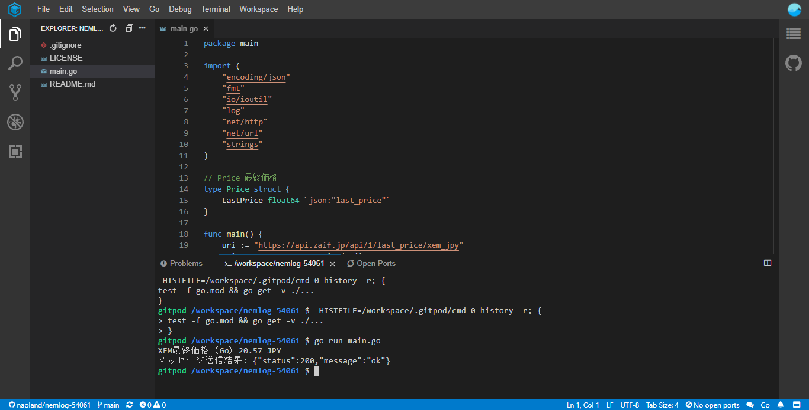
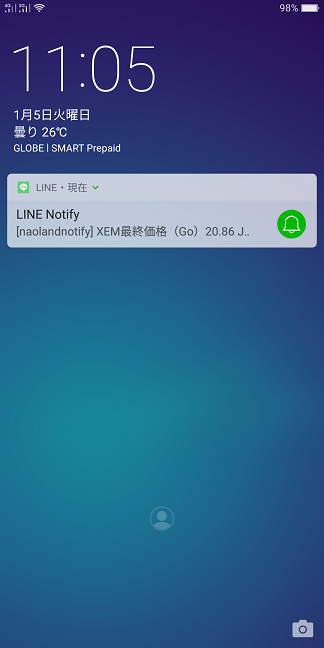
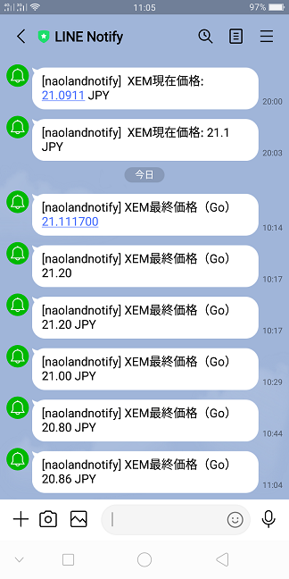

# 簡単プログラミング！XEMの現在価格をLINEに通知しよう（Go編）

## はじめに

[簡単プログラミング！XEMの現在価格をLINEに通知しよう（Python編）](https://nemlog.nem.social/blog/53456)のGo言語バージョンです。
この記事はPython版を一通り読んだことを前提にして、必要な情報のみ追記しています。

## Gitpodでの動作確認



## 実行結果

上記のようにターミナルで`go run main.go`と入力し、 プログラムを実行すると、次の結果が表示されます。

```
XEM最終価格（Go）20.86 JPY
メッセージ送信結果: {"status":200,"message":"ok"}
```

待ち受け画面



一覧



## コードの説明

一応コードを貼り付けますが、今回は少々難しくなってしまったので、説明を割愛します。
より簡単な題材で、Goのコードの説明をしようと思っています。

```go

package main

import (
	"encoding/json"
	"fmt"
	"io/ioutil"
	"log"
	"net/http"
	"net/url"
	"strings"
)

// Price 最終価格
type Price struct {
	LastPrice float64 `json:"last_price"`
}

func main() {
	uri := "https://api.zaif.jp/api/1/last_price/xem_jpy"
	price, err := getLastPrice(uri)
	if err != nil {
		log.Fatal(err)
	}
	message := fmt.Sprintf("XEM最終価格（Go）%.2f JPY", price.LastPrice)
	fmt.Println(message)
	sendlinemessage(message)
}

func getLastPrice(url string) (*Price, error) {
	req, err := http.NewRequest("GET", url, nil)
	if err != nil {
		log.Fatal(err)
		return nil, err
	}

	client := new(http.Client)
	res, err := client.Do(req)
	if err != nil {
		log.Fatal(err)
		return nil, err
	}
	defer res.Body.Close()

	bytes, err := ioutil.ReadAll(res.Body)
	if err != nil {
		log.Fatal(err)
		return nil, err
	}
	// fmt.Println(string(bytes))

	var price Price
	err = json.Unmarshal(bytes, &price)
	if err != nil {
		log.Fatal(err)
		return nil, err
	}
	// fmt.Printf("%.2f\n", price.LastPrice)

	return &price, nil
}

func sendlinemessage(message string) {
    token := "Your access token" // ご自身のトークンと置き換えてください
	api := "https://notify-api.line.me/api/notify"

	values := url.Values{}
	values.Add("message", message)

	req, err := http.NewRequest("POST", api, strings.NewReader(values.Encode()))
	if err != nil {
		log.Fatal(err)
	}
	req.Header.Set("Content-Type", "application/x-www-form-urlencoded")
	req.Header.Set("Authorization", "Bearer "+token)

	resp, err := http.DefaultClient.Do(req)
	if err != nil {
		log.Fatal(err)
	}
	defer resp.Body.Close()

	body, err := ioutil.ReadAll(resp.Body)
	if err != nil {
		log.Fatal(err)
	}
	fmt.Printf("メッセージ送信結果: %s\n", body)
}

```

## まとめ

Pythonに比べると、コード量が増えていることにお気づきだと思います。
Go言語はプログラムが扱うデータなどの型を厳格に扱いますし、例外処理の機構を持たないため、エラーが発生時の処理が多少冗長になる傾向があります。
また、JSONデータをいとも簡単に扱えるPythonと比べ、Goでは面倒な記述が増えます。
しかし、数か月後同じコードを理解しようとしたとき、Goの型の存在があなたの理解を助けてくれます。
プログラミング言語にはそれぞれ特徴があるので、用途や自分に向いているとかいないかなども理解しておくと良いと思います。

簡単プログラミングシリーズでは、TypeScript/JavaScript、Python、Go、Rust言語を使っていく予定です。また動作環境は今後もGitpodを使っていきます。
もちろん、ご自身の環境にプログラミング言語をインストールして、いろいろ試していただくのも良いと思います。

## 関連情報へのリンク

- [LINEに通知するための準備](https://nemlog.nem.social/blog/53471)
- [現物公開API — Zaif api document v2.0.0 ドキュメント](https://zaif-api-document.readthedocs.io/ja/latest/PublicAPI.html)
- [LINE Notify API Document](https://notify-bot.line.me/doc/ja/)  
上記ドキュメントの「通知系」の箇所をご覧ください。
- [Environment Variables - Gitpod](https://www.gitpod.io/docs/environment-variables/#using-the-command-line-code-classlanguage-textgp-envcode)
- [簡単プログラミング！XEMの現在価格をLINEに通知しよう（Python編）](https://github.com/naoland/nemlog-53456) github
- [簡単プログラミング！XEMの現在価格をLINEに通知しよう（Python編）](https://nemlog.nem.social/blog/53456) nemlog
- [簡単プログラミング！XEMの現在価格をLINEに通知しよう（Go編）](https://nemlog.nem.social/blog/54061) nemlog
- [簡単プログラミング！XEMの現在価格をLINEに通知しよう（Go編）](https://github.com/naoland/nemlog-54061) github
